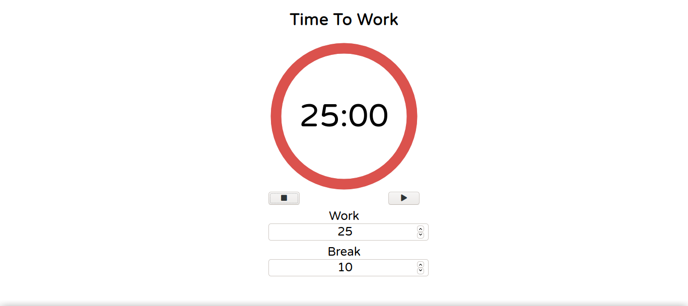

<p align="center">
  <a href="https://www.twitter.com/tiagod3p/">
    
  </a>
  
  <a href="https://github.com/tiagod3p/pomodoro-reason/commits/master">
    
  </a>
    
   

   <a href="https://github.com/tiagod3p/pomodoro-reason/stargazers">
    
  </a>

  <a href="https://www.linkedin.com/in/tiagovidaldepaula/">
    
  </a>
</p>
<h1 align="center">
    
</h1>

<h4 align="center"> 
	🚧 Pomodoro :tomato: In progress... 🚀 🚧
</h4>

<p align="center">
 <a href="#-about-the-project">About</a> •
 <a href="#-layout">Layout</a> • 
 <a href="#-how-it-works">How it works</a> • 
 <a href="#-tech-stack">Tech Stack</a> • 
 <a href="#-how-to-contribute">How to contribute</a> • 
 <a href="#-author">Author</a> • 
 <a href="#user-content--license">License</a>
</p>


## 💻 About the project

:tomato: Pomodoro is an timer that helps you to focus on complete your tasks by setting a default time to work and a default time to rest.

---

## 🎨 Layout

<p align="center" style="display: flex; align-items: flex-start; justify-content: center;">
  
</p>
---

## 🚀 How it works

### Pre-requisites

Before you begin, you will need to have the following tools installed on your machine:
[Git](https://git-scm.com), [Node.js](https://nodejs.org/en/). 
In addition, it is good to have an editor to work with the code like [VSCode](https://code.visualstudio.com/)


#### 🧭 Running the web application

```bash

# Clone this repository
$ git clone https://github.com/tiagod3p/pomodoro-reason.git

# Access the project folder in your terminal
$ cd pomodoro-reason

# Install the dependencies
$ npm install

# Open 2 terminal windows
# Run server
$ npm run server

# Run the application in other tab of terminal
$ npm start

# The application will open on the port: 8000 - go to http://localhost:8000

```

---

## 🛠 Tech Stack

The following tools were used in the construction of the project:

#### **Website**
-   **[ReasonML](https://reasonml.github.io/)**
-   **[ReScript](https://rescript-lang.org/)**
-   **[Node.js](https://nodejs.org/)**


---

## 💪 How to contribute

1. Fork the project.
2. Create a new branch with your changes: git checkout -b my-feature
3. Save your changes and create a commit message telling you what you did: git commit -m" feature: My new feature "
4. Submit your changes: git push origin my-feature
5. Open a pull request!

When the merge of your pull request is done, you can delete your branch.

You can send me as many PR's as you want, I will be honored to review and accept them!

---

## 🦸 Author


 
 <br />
 <sub><b>Tiago Vidal</b></sub>
 <br />

[](https://twitter.com/tiagod3p) [](https://www.linkedin.com/in/tiagovidaldepaula/) 
[](mailto:tiagod3p@gmail.com)

---

## 📝 License

This project is under the license MIT.

Made with ❤️ by Tiago Vidal 👋🏽 [Get in touch!](https://www.linkedin.com/in/tiagovidaldepaula/)

---
